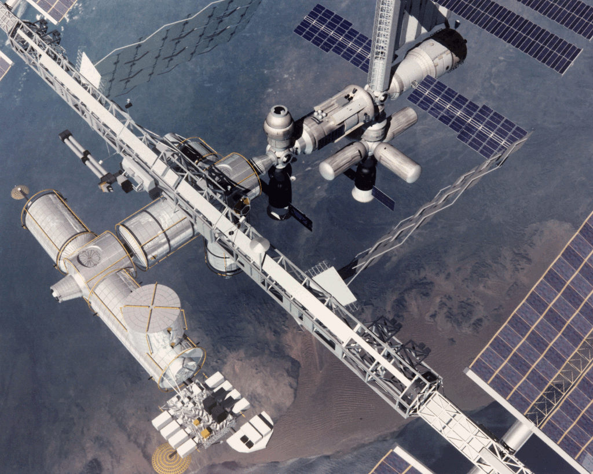

International Space Station Position Tracker
============================================

*Android Architecture using MVP + RxJava + Retrolambda + Retrofit*

This is a project to show how to develop clean Android applications using the Model-View-Presenter Pattern with RxJava, Retrolambda and Retrofit.

 

<b><a href="#features">Features</a></b>
|
<b><a href="#download">Download</a></b>
|
<b><a href="#who-made-this">Who Made This</a></b>
|
<b><a href="#bugs-and-feedback">Bugs and Feedback</a></b>
|
<b><a href="#licensing">Licensing</a></b>

 

### Features

* Current location of the ISS
* Overhead Pass Predictions for the ISS
* Number of people in Space

### Download

WIP

Who made this
--------------

| 
|---
| [Ferran Pons](https://github.com/ferranpons)

Hi! I'm Ferran Pons; a Senior Android Developer that works for Adevinta Spain. With almost 15 years of experience as a programmer, my experience covers a lot of different kind of applications, from web app development to the desktop, mobile apps and videogames. I've participated in some blockbuster games such as Burnout Paradise, DeadSpace and the Skate franchise. Also I'm the owner of "Retrowax Games", an independent videogame studio, with which I've made this game that was published for the Xbox360 and Windows Phone and PC Windows.

Bugs and Feedback
-----------------

For bugs, questions and discussions please use the [Github Issues](https://github.com/ferranpons/iss-position/issues).

Licensing
---------

Copyright 2016-2021 Ferran Pons

Licensed under the Apache License, Version 2.0 (the "License");
you may not use this file except in compliance with the License.
You may obtain a copy of the License at

    http://www.apache.org/licenses/LICENSE-2.0

Unless required by applicable law or agreed to in writing, software
distributed under the License is distributed on an "AS IS" BASIS,
WITHOUT WARRANTIES OR CONDITIONS OF ANY KIND, either express or implied.
See the License for the specific language governing permissions and
limitations under the License.
